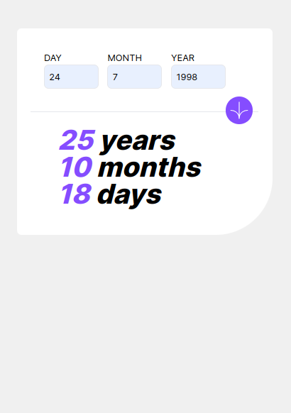

# Age Calculator

This is a simple age calculator application built with Next.js. Users can input their birth date and calculate their age in years, months, and days by clicking on an arrow icon.

## Features

- Input fields for day, month, and year
- Calculate age based on the provided birth date
- Display age in years, months, and days
- Clean and user-friendly interface

## Screenshots

### Input Birth Date and ### Calculated Age




## Getting Started

These instructions will help you set up and run the project on your local machine for development and testing purposes.

### Prerequisites

- Node.js
- npm (or yarn)

### Installation

1. Clone the repository:
   ```bash
   git clone https://github.com/cindykandie/exact-age-calculator.git
   ```

2. Navigate to the project directory:
   ```bash
   cd exact-age-calculator
   ```

3. Install the dependencies:
   ```bash
   npm install
   ```

   or

   ```bash
   yarn install
   ```

### Running the Application

To start the development server, run:

```bash
npm run dev
```

or

```bash
yarn dev
```

Open [http://localhost:3000](http://localhost:3000) in your browser to see the application.

## Usage

1. Enter your birth date in the provided input fields (day, month, year).
2. Click on the arrow icon to calculate your age.
3. Your age will be displayed in years, months, and days.

## Code Overview

- `src/app/page.js`: Main page component containing the input fields and the logic to calculate and display the age.

## Contributing

Contributions are welcome! Please open an issue or submit a pull request for any bugs or enhancements.

## License

This project is licensed under the MIT License - see the [LICENSE](LICENSE) file for details.

## Acknowledgements

- Thanks to the Next.js team for creating an awesome framework.
